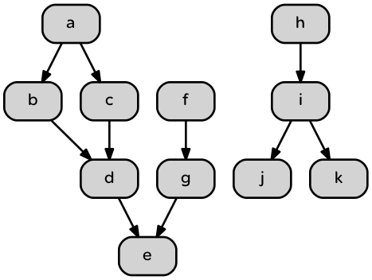

Akka Micro Dag Prototype
=========================

Define and run the simplest possible Akka executor directed acyclic graph
 
 As input the DAG takes a graph adjacency list and a payload for each executor:
 
 Node ID  | List of Precursors | Payload command
------------- | ------------- | ------------
a  | (none - we start here)  | println(a)
b  | a | println(b)
c  | a | println(c)
d  | b,c | println(d)
e  | d | println(e)

The input configuration is a JSON data structure that reflects the above relationships.

```json
[
{ "name" : "a", "precursors" : [], "payload" : {"cmd":"println(\"a\")"} },
{ "name" : "b", "precursors" : ["a"], "payload" : {"cmd":"println(\"b\")"} },
{ "name" : "c", "precursors" : ["a"], "payload" : {"cmd":"println(\"c\")"} },
{ "name" : "d", "precursors" : ["b","c"], "payload" : {"cmd":"println(\"d\")"} },
{ "name" : "e", "precursors" : ["d"], "payload" : {"cmd":"println(\"e\")"} }
]
```


The execution follows the graph flow - a node only executes its payload when all its precursors have successfully completed.

##How to run
```bash
$ sbt
[info] Loading global plugins from /Users/v/.sbt/0.13/plugins
[info] Loading project definition from /Users/v/wa/akka-micro-dag/project
[info] Set current project to akka-micro-dag (in build file:/Users/v/wa/akka-micro-dag/)
> run dag.json
:
```
will parse the json input file, construct the corresponding actor graph and execute it. Printing out payload strings.

##A more interesting execution graph


Here the DAG implementation has to know to kick off nodes a, f and h. The (h,i,j,k) sub-graph is independent.
The user specifies the relationships like this:

```json
[
  {"id": "a","precursors": [],        "payload": "exe a"},
  {"id": "b","precursors": ["a"],     "payload": "exe b"},
  {"id": "c","precursors": ["a"],     "payload": "exe c"},
  {"id": "d","precursors": ["b","c"], "payload": "exe d"},
  {"id": "e","precursors": ["d","g"], "payload": "exe e"},
  {"id": "f","precursors": [],        "payload": "exe f"},
  {"id": "g","precursors": ["f"],     "payload": "exe g"},
  {"id": "h","precursors": [],        "payload": "exe h"},
  {"id": "i","precursors": ["h"],     "payload": "exe i"},
  {"id": "j","precursors": ["i"],     "payload": "exe j"},
  {"id": "k","precursors": ["i"],     "payload": "exe k"}
]
```

The run sequence looks like this (with all tasks taking roughly the same time to execute - a single println statement):

```bash
λ sbt
> run dag1.json
background log: info: exe a
background log: info: exe h
background log: info: exe f
background log: info: exe i
background log: info: exe g
background log: info: exe b
background log: info: exe c
background log: info: exe d
background log: info: exe j
background log: info: exe k
background log: info: exe e
background log: info: b reported complete - now total complete List(a, f, h, i, g, b, c, d, j, k, e)
background log: info: run completed
[success] Total time: 1 s, completed Jun 12, 2015 1:47:08 PM
>
```

