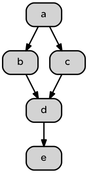

Akka Micro Dag Prototype
=========================

Define and run the simplest possible Akka executor directed acyclic graph
 
 As input the DAG takes a graph adjacency list and a payload for each executor:
 
 Node ID  | List of Precursors | Payload command
------------- | ------------- | ------------
a  | (none - we start here)  | println(a)
b  | a | println(b)
c  | a | println(c)
d  | b,c | println(d)
e  | d | println(e)

The input configuration is a JSON data structure that reflects the above relationships.

```json
[
{ "name" : "a", "precursors" : [], "payload" : {"cmd":"println(\"a\")"} },
{ "name" : "b", "precursors" : ["a"], "payload" : {"cmd":"println(\"b\")"} },
{ "name" : "c", "precursors" : ["a"], "payload" : {"cmd":"println(\"c\")"} },
{ "name" : "d", "precursors" : ["b","c"], "payload" : {"cmd":"println(\"d\")"} },
{ "name" : "e", "precursors" : ["d"], "payload" : {"cmd":"println(\"e\")"} }
]
```




